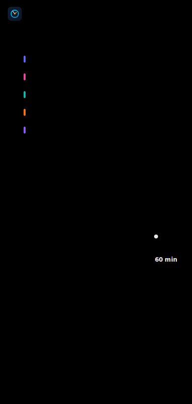

> [!CAUTION]
> This entire project was built by Claude Code (Sonnet 4.6). Initiated, and then guided by human (me) prompting, a steady stream of “ah, and can you also…” and two evenings of iterative back and forth. Started from an empty folder, it evolved under its own self-authored guidance system (the agent memory living in /docs), to a working app with the only human-written content in this opening paragraph.
>
> Credit where it is due: impressive speed, clean UI, and a solid overall architecture. It even keeps its documentation up-to-date unprompted, in both the repository and the [Wiki](https://github.com/niels-emmer/time-keeper/wiki). That documentation however, rarely mentions “security” which is not an accident. The code relies on unvetted libraries, has not been pentested, and could theoretically exfiltrate your toothbrush for all I know. See [SECURITY.md](SECURITY.md) for the details.
 
# Time Keeper

A self-hosted personal work-timer PWA. Track time against named categories from any device, view weekly summaries, and copy them into Workday (or any time registration tool) with one click.

Runs as a PWA — installs to the macOS Dock and Android home screen with no app store required.

## Screenshots

<table>
  <tr>
    <td align="center"><br/><sub><b>Track</b> — tap a category to start</sub></td>
    <td align="center"><br/><sub><b>Weekly</b> — hours by category × day</sub></td>
    <td align="center"><br/><sub><b>Settings</b> — categories &amp; weekly goal</sub></td>
  </tr>
</table>

> These are SVG mockups generated from source code, to protect the innocent.

## Features

- **One-tap timer** — tap a category to start, tap Stop to finish; starting a new category auto-stops the previous one
- **Weekly goal** — configurable hours per week (0–40); shown in the top bar and weekly summary, drives the rounding cap
- **Weekly overview** — time per category per day, copy to clipboard in a format ready to paste into your time registration tool
- **End-of-day rounding** — round tracked minutes up to the nearest 30 or 60 minutes (configurable), capped at your weekly goal
- **PWA** — installable on macOS and Android, runs in standalone mode (no browser chrome)
- **Self-hosted** — runs in Docker, no external services or accounts required beyond your own Authentik instance

## Tech stack

| Layer | Choice |
|-------|--------|
| Frontend | React 18 + Vite + Tailwind CSS + shadcn/ui |
| Backend | Node.js 22 + Express + Drizzle ORM |
| Database | SQLite (better-sqlite3, WAL mode) |
| Auth | Authentik embedded outpost via Nginx Proxy Manager forward auth |
| Container | Docker Compose |

## Prerequisites

**To deploy (production):**
- [Docker Engine 24+](https://docs.docker.com/engine/install/) with [Docker Compose v2](https://docs.docker.com/compose/install/)
- An [Authentik](https://goauthentik.io) instance (or another identity provider — see [auth integration guide](docs/integration/auth.md))
- [Nginx Proxy Manager](https://nginxproxymanager.com) (or another reverse proxy with forward auth support)
- A domain name with SSL

**To develop locally:**
- [Node.js 22+](https://nodejs.org/en/download) — ([nvm](https://github.com/nvm-sh/nvm) / [fnm](https://github.com/Schniz/fnm) recommended for version management)
- [Yarn 4](https://yarnpkg.com/getting-started/install) via Corepack (ships with Node.js 16.9+)

## Quick start (local development)

```bash
# 1. Install dependencies (requires Node 22+ and Yarn 4 via corepack)
corepack enable
yarn install

# 2. Start the backend (Terminal 1)
DEV_USER_ID=you@example.com yarn workspace @time-keeper/backend dev

# 3. Start the frontend (Terminal 2)
yarn workspace @time-keeper/frontend dev
```

Open http://localhost:5173. Auth is bypassed in dev mode — all data is stored under the `DEV_USER_ID` value.

## Deployment

See [docs/operations/deployment.md](docs/operations/deployment.md) for the full guide, including:
- Docker Compose setup
- Nginx Proxy Manager configuration
- Authentik provider and outpost setup

The short version:
1. Clone the repo on your VPS
2. `docker compose up -d --build`
3. Create a **Proxy Provider** in Authentik (forward auth mode, external host = your domain)
4. Add it to your existing proxy outpost
5. Add a proxy host in NPM pointing to `192.168.x.x:38521` (your server's LAN IP) with the standard Authentik forward auth Advanced config

## Documentation

| Path | Contents |
|------|----------|
| [AGENTS.md](AGENTS.md) | Entry point for AI coding agents |
| [docs/memory/INDEX.md](docs/memory/INDEX.md) | Architecture overview and session guide |
| [docs/integration/auth.md](docs/integration/auth.md) | Authentik + NPM wiring |
| [docs/integration/docker.md](docs/integration/docker.md) | Docker services and volumes |
| [docs/integration/pwa.md](docs/integration/pwa.md) | Installing on macOS and Android |
| [docs/operations/deployment.md](docs/operations/deployment.md) | Production deployment guide |
| [docs/operations/runbooks.md](docs/operations/runbooks.md) | Common break/fix procedures |
| [SECURITY.md](SECURITY.md) | Security posture, risks, and dependency audit |

## Customising categories

Categories are managed in the app itself (Settings tab). Add one category per booking type you want to track. The optional "Workday code" field appears in the weekly copy output.

## Multi-user support

The app is multi-user capable out of the box. Each user's data is fully isolated by the email address Authentik sets in the `X-authentik-email` header — no configuration required. Add users to your Authentik application and they each get their own independent set of categories and time entries.

There is no shared data, cross-user reporting, or admin interface — each user only ever sees their own data.

## Attribution

Original idea and product direction by the author. All code, architecture, and debugging by [Claude Code](https://claude.ai/claude-code) (Claude Sonnet 4.5 / Opus 4.6, Anthropic).
