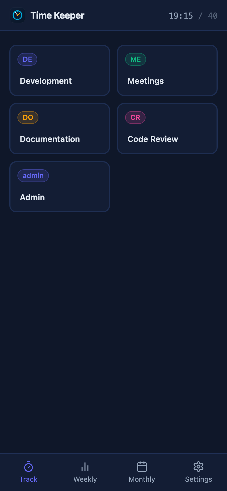
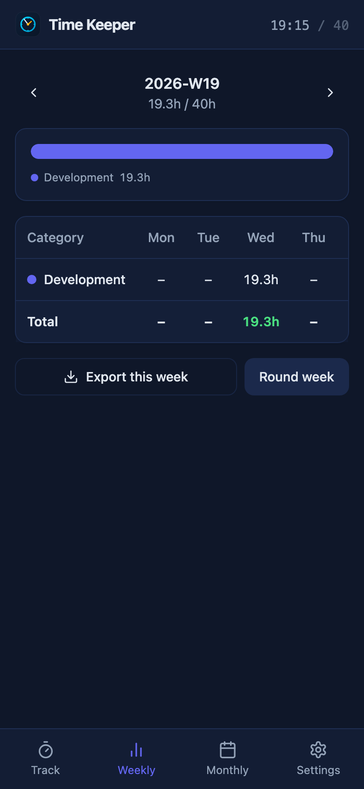
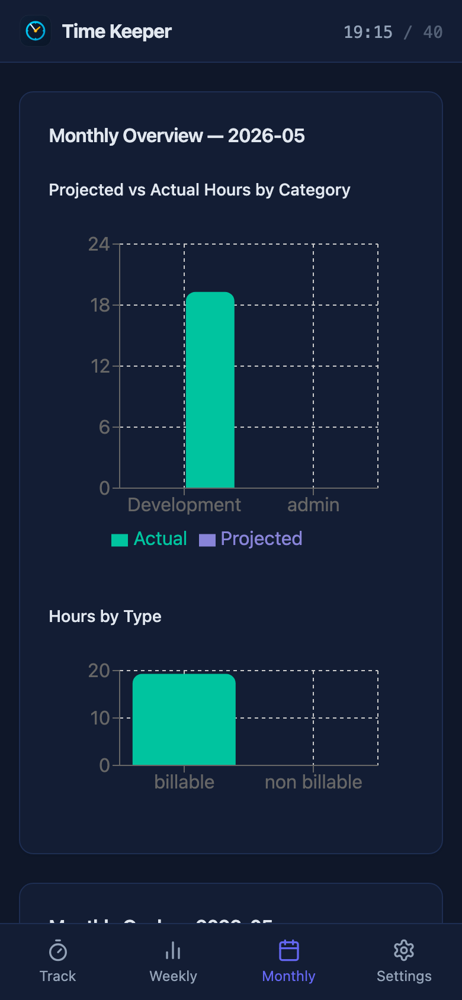
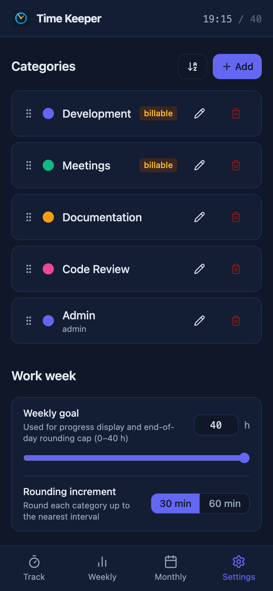

> This project was built entirely by AI (Pi, Claude Code, GPT-5.4) from an empty folder, guided by iterative human prompting. It manages its own documentation in `docs/memory/` and keeps the Wiki and code in sync unprompted. For security and dependency details, see [SECURITY.md](SECURITY.md) and the [Wiki](https://github.com/niels-emmer/time-keeper/wiki).

# Time Keeper

A self-hosted personal work-timer PWA. Track time against named categories from any device, view weekly summaries, and copy them into Workday (or any time registration tool) with one click.

Runs as a PWA — installs to the macOS Dock and Android home screen with no app store required.

## Screenshots

<table>
  <tr>
    <td align="center"><br/><sub><b>Track</b> — tap a category to start</sub></td>
    <td align="center"><br/><sub><b>Weekly</b> — hours by category × day</sub></td>
  </tr>
  <tr>
    <td align="center"><br/><sub><b>Monthly</b> — projected vs actual + billable breakdown</sub></td>
    <td align="center"><br/><sub><b>Settings</b> — categories, targets &amp; weekly goal</sub></td>
  </tr>
</table>


## Features

- **One-tap timer** — tap a category to start, tap Stop to finish; starting a new category auto-stops the previous one, and the Track screen now supports search, pinned categories, and recent-category sections for faster switching
- **Weekly goal** — configurable hours per week (0–40); shown in the top bar and weekly summary, drives the rounding cap
- **Monthly tab** — dedicated monthly planning view with month navigation, per-category targets, status chips, projected vs actual comparison, pace guidance, and billable vs non-billable breakdown
- **Billable activity** — mark categories as billable or non-billable for monthly overview reporting
- **Weekly overview** — time per category per day; click any cell to edit hours inline (totals update live as you type), open day logs to inspect/edit/delete the actual entries, backfill missed work, review the week, and copy or download CSV/plain-text/compact handoff formats
- **End-of-day rounding** — round tracked minutes up to the nearest 30 or 60 minutes (configurable), capped at your weekly goal
- **Light / dark / system theme** — follows your OS preference by default; override per-device in Settings
- **PWA** — installable on macOS and Android, runs in standalone mode (no browser chrome), automatically checks for a new version when the app opens or resumes, shows an in-app update banner when one is ready, and surfaces connectivity status/reconnect feedback
- **macOS status bar app** — native Flutter app lives in the menu bar; icon shows active timer color + `CODE hh:mm`; click to open a popover panel with full Track / Weekly / Settings functionality
- **Self-hosted** — runs in Docker, no external services or accounts required beyond your own Authentik instance
- **Personal access tokens** — browser-created tokens for the native app, shown once, hashed at rest, and expiring after one year

## Tech stack

| Layer | Choice |
|-------|--------|
| Frontend | React 18 + Vite + Tailwind CSS + shadcn/ui |
| Backend | Node.js 22 + Express + Drizzle ORM |
| Database | SQLite (better-sqlite3, WAL mode) |
| Auth | Authentik embedded outpost via Nginx Proxy Manager forward auth |
| Container | Docker Compose |

## Prerequisites

**To deploy (production):**
- [Docker Engine 24+](https://docs.docker.com/engine/install/) with [Docker Compose v2](https://docs.docker.com/compose/install/)
- An [Authentik](https://goauthentik.io) instance (see the [auth integration guide](docs/integration/auth.md))
- [Nginx Proxy Manager](https://nginxproxymanager.com) (or another reverse proxy with forward auth support)
- A domain name with SSL

**To develop locally:**
- [Node.js 22+](https://nodejs.org/en/download) — ([nvm](https://github.com/nvm-sh/nvm) / [fnm](https://github.com/Schniz/fnm) recommended for version management)
- [Yarn 4](https://yarnpkg.com/getting-started/install) via Corepack (ships with Node.js 16.9+)

## Quick start (local development)

```bash
# 1. Install dependencies (requires Node 22+ and Yarn 4 via corepack)
corepack enable
yarn install

# 2. Start the backend (Terminal 1)
DEV_USER_ID=you@example.com yarn workspace @time-keeper/backend dev

# 3. Start the frontend (Terminal 2)
yarn workspace @time-keeper/frontend dev
```

Open http://localhost:5173. Auth is bypassed in dev mode — all data is stored under the `DEV_USER_ID` value.

## Deployment

See [docs/operations/deployment.md](docs/operations/deployment.md) for the full guide, including:
- Docker Compose setup
- Nginx Proxy Manager configuration
- Authentik provider and outpost setup

The short version:
1. Clone the repo on your VPS
2. Generate `INTERNAL_PROXY_SECRET` with `openssl rand -hex 32` and store it in `.env`
3. Run `APP_VERSION=$(git describe --tags --abbrev=0) docker compose up -d --build` for the first deploy
4. Use `./refresh-vps.sh` for later pull-and-rebuild updates
5. Create a **Proxy Provider** in Authentik (forward auth mode, external host = your domain)
6. Add it to your existing proxy outpost
7. Add a proxy host in NPM pointing to `192.168.x.x:38521` (your server's LAN IP) with the standard Authentik forward auth Advanced config

## Documentation

| Path | Contents |
|------|----------|
| [Wiki](https://github.com/niels-emmer/time-keeper/wiki) | Full user and operator documentation |
| [AGENTS.md](AGENTS.md) | Entry point, bootstrap order, and the canonical catalog for repo-local Pi surfaces |
| [.pi/APPEND_SYSTEM.md](.pi/APPEND_SYSTEM.md), [.pi-rules](.pi-rules), [.pi-context](.pi-context), [CONTEXT.md](CONTEXT.md) | Repo-local operating contract, workspace rules, and bootstrap context |
| [.pi/settings.json](.pi/settings.json), [.pi/extensions/](.pi/extensions/), [.pi/skills/](.pi/skills/), [.pi/agents/](.pi/agents/), [.pi/prompts/session-init.md](.pi/prompts/session-init.md) | Repo-local Pi packages, extensions, skills, agents, and prompts |
| [docs/memory/INDEX.md](docs/memory/INDEX.md) | Architecture overview, routing, and deeper links |
| [docs/integration/](docs/integration) | Auth, Docker, PWA, and native-app integration docs |
| [docs/operations/](docs/operations) | Local development, deployment, and runbooks |
| [packages/macos_app/README.md](packages/macos_app/README.md) | macOS status bar app build and setup |
| [SECURITY.md](SECURITY.md) | Security posture, risks, and dependency audit |

Repo-local Pi surfaces above are defined by this repository. Your runtime may also expose additional builtin or user-level agents, but those are environment-specific and are not part of Time Keeper's repo contract unless documented here or in `AGENTS.md`.

## Customising categories

Categories are managed in the app itself (Settings tab). Add one category per booking type you want to track, then optionally configure target hours directly in the category editor as a monthly target, weekly target, or one-time budget. The optional "Workday code" field appears in the weekly copy output.

## Multi-user support

The app is multi-user capable out of the box. Each user's data is fully isolated by the email address Authentik sets in the `X-authentik-email` header — no configuration required. Add users to your Authentik application and they each get their own independent set of categories and time entries.

There is no shared data, cross-user reporting, or admin interface — each user only ever sees their own data.

## Attribution

Original idea and product direction by the author. Built entirely by AI: [Claude Code](https://claude.ai/claude-code) (Claude Sonnet 4.5 / Opus 4.6, Anthropic), [GitHub Copilot](https://github.com/features/copilot) (Claude Haiku, Anthropic), and [GPT-4](https://openai.com/gpt-4) (OpenAI). Guided by exceptional iterative prompting — the key to coherent, self-documenting AI-driven development.
